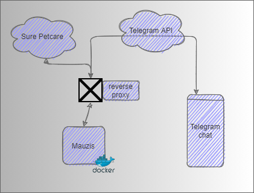

# Mauzis
This code is connectiong to the Sure Petcare server by a valid account and provieds some functions to interact with Petcare devices trough a Telegram Bot.
  
## Install

Best usage is to run it behind a reverse proxy in a docker container, at least that's the way I do it ;)




Copy in Unraid (Domain specific)
```
cp /boot/config/plugins/dockerMAn/templates-user/my-Mauzis.xml /boot/config/plugins/community.applications/private/myrepo
```

Get ID's and stuff
```
https://api.telegram.org/bot<YourBOTToken>/getUpdates
```
